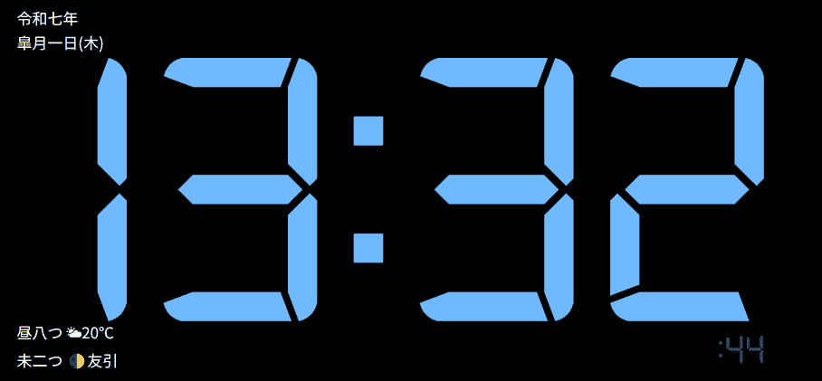

# 和風スタンバイ時計

<p align="center">
  
</p>

iPhone / iPad のスタンバイ表示を想定した、和暦・正刻・時辰・天気・月齢・六曜付きの時計です。
設定レイヤーを開いても時計本体は背面で描画を続け、実表示を見ながらその場で調整できます。

[公開ページ](https://kinoko34077.github.io/standby-display/)

## 主な機能

- 和暦 / 西暦の切替
- 正刻・時辰・天気・月齢・六曜の表示
- PWA 対応
- HUD 型の設定オーバーレイ
- 秒表示、時間形式、書字方向、フォント、色、表示情報の切替
- 日次のランダム色（時計・文字・背景）と色相・明度の範囲指定
- ランダム色スイッチの切替時の再抽選
- Android のタッチ操作に対応した色選択（iro.js、読み込み失敗時は標準色選択へフォールバック）
- `localStorage` への設定保存
- 現在設定の URL 共有

## 現在の構成

| ファイル | 役割 |
|---|---|
| `index.html` | 時計レイヤーと設定レイヤーの DOM |
| `style.css` | 時計表示、設定 HUD、レスポンシブレイアウト |
| `app.mjs` | エントリーポイント |
| `scripts/clock-app.mjs` | アプリ状態、同期、設定適用、UI 連携 |
| `scripts/settings.mjs` | 設定の既定値、URL / localStorage 変換 |
| `scripts/settings-ui.mjs` | 設定 UI のイベント処理と描画 |
| `scripts/color-controls.mjs` | タッチ対応カラーピッカーと色範囲UI |
| `scripts/random-colors.mjs` | 日付固定のランダム色生成と範囲正規化 |
| `scripts/formatters.mjs` | 時計・日付・付加情報の表示文字列生成 |
| `scripts/render.mjs` | DOM 反映 |
| `scripts/services.mjs` | 時刻同期、位置情報、天気、月齢、六曜取得 |
| `scripts/browser-features.mjs` | Wake Lock、ビューポート補正、Service Worker 登録 |
| `manifest.json` | PWA 設定 |
| `service-worker.js` | キャッシュ制御 |

## 設定 UI

- 半透明の全画面オーバーレイとして表示
- 必要時のみ部分表示へ切替
- 設定中も背面の時計は更新継続
- 変更は即時反映
- URL は共有 / 復元用、`localStorage` は常用設定用として使用
- 「毎日のランダム色」は日付ごとに同じ色を再現し、時計色・文字色を対象にする。背景色は別スイッチで有効化する。

色選択には、タッチスクリーン対応・依存なし・HSL/HSV 対応の [iro.js](https://iro.js.org/) 5.5.2 を使用しています。CDN が利用できない場合は既存の標準カラーピッカーへ戻ります。

## 今後の課題

- 旧字体変換辞書を内部モジュールとして拡張
- 実機での Wake Lock / PWA / Service Worker 更新確認
- フォント配信の完全ローカル化

## 通常版と旧端末用の統合

通常版と軽量版は同じブランチで管理し、旧端末用を`legacy/`に配置しています。
入口の`bootstrap.js`はES5で動き、モジュール・fetch・Pointer Events・CSS変数・Grid・min()等の対応を確認します。
通常版の構文解析/起動に失敗した場合や、15秒以内に画面が起動しない場合も軽量版へ移動します。
時計描画の起動完了はAPI通信完了と分離しているため、天気取得の遅さだけでは切り替わりません。

- 通常の入口: `/`（対応機能で自動判定）
- 軽量版を指定: `/?mode=legacy` または `/legacy/`
- 通常版を試す: `/?mode=modern`（起動失敗時の退避は有効）
- 通常版の設定画面に「軽量版を開く」を追加。現在の設定をURLで渡します。
- 軽量版の「標準表示を試す」で自動判定へ戻ります。

GitHub Pagesの`/standby-display/`配下でも同じ相対パスで動作します。
判定はUser-Agentの機種名に依存しません。iPad第3世代相当（申告型番MC705J/A）/iOS 9では、
モジュール等の未対応により通常版を読み込む前に軽量版へ切り替わる設計です。

### 軽量版の機能

旧Cloudflare `legacy-clock` のHTML/CSS構成を元に、ES5 + XMLHttpRequestで実装しています。
元コードの固定日付・固定天気を廃止し、現在時刻・和暦/西暦・正刻・時辰を更新します。
時刻同期、六曜、位置情報による天気/月齢取得を行い、通信失敗時も時計を動かし続けます。
位置情報が使えない場合は天気/月齢を未取得表示にします。

同一オリジンの保存設定とURL設定から、秒・12/24時間・和暦/西暦・表示項目・色を引き継ぎます。
旧字変換、縦書き、フォント選択、通常版の設定パネルは軽量版の対象外です。
iOS 9ではPWA Service Worker/Wake Lockには依存しません。OS側の画面自動ロック設定は別途必要です。
現行ブラウザのPWAキャッシュには通常版・軽量版両方のファイルを含めています。

| ファイル | 役割 |
| --- | --- |
| `bootstrap.js` | ES5の機能判定と起動監視 |
| `modern-entry.mjs` | 現行構文を解析し、通常版を起動 |
| `legacy/index.html`, `legacy/style.css`, `legacy/clock.js` | 旧端末向けの画面・時計・通信 |
| `shared/config.js` | 両版で共有するAPI URL |
| `docs/legacy-worker-original.mjs` | 取得したCloudflare旧端末用Workerの元コード（配信対象外） |
| `tests/compatibility.test.mjs` | ES5構文、機能不足/起動失敗、日付・設定・通信の検証 |

## 開発・Cloudflare公開

```sh
npm ci
npm test
npm run dev
npm run build
npx wrangler deploy --dry-run
npm run deploy
```

Wrangler設定は`wrangler.jsonc`に一本化し、公開先は新KiNoTchアカウントの
`standby-display.kinotch.workers.dev`です。`tools/build-assets.mjs`はブラウザ向けファイルだけを`dist/`へコピーします。
元Worker資料・テスト・設定・Git履歴は配信しません。APIは新アカウントの既存Workerを利用します。

Cloudflareに残る独立`legacy-clock`と旧QR用リダイレクトは、この統合だけでは変更・削除しません。
Workers Buildsを接続する場合: build=`npm run build`、deploy=`npx wrangler deploy`、root=`/`。

この変更では本ディレクトリのソースを基準とし、別作業フォルダの新しいGitHub版は上書き統合していません。
機能判定の参考: [MDN noModule](https://developer.mozilla.org/en-US/docs/Web/API/HTMLScriptElement/noModule)、
[CSS feature queries](https://developer.mozilla.org/en-US/docs/Web/CSS/Guides/Conditional_rules/Using_feature_queries)。
