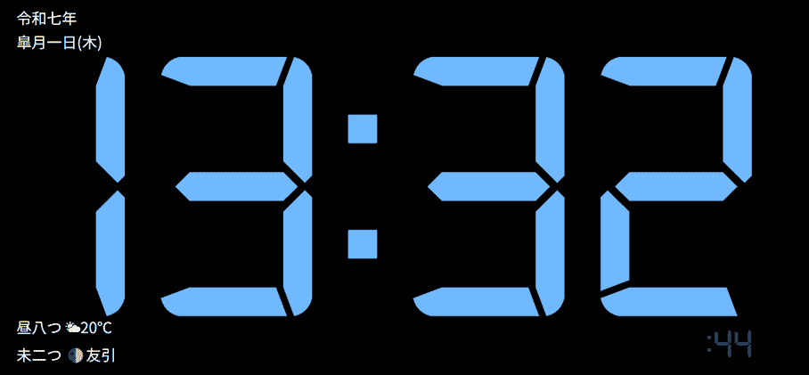

# 和風スタンバイ時計

<p align="center">
  
</p>

iPhone / iPad のスタンバイ表示を想定した、和暦・正刻・時辰・天気・月齢・六曜付きの時計です。
設定レイヤーを開いても時計本体は背面で描画を続け、実表示を見ながらその場で調整できます。

[公開ページ（canonical）](https://standby-display.kinotch.workers.dev/)

GitHub Pages版（`https://kinoko34077.github.io/standby-display/`）も同じソースから提供しています。

## 主な機能

- 和暦 / 西暦の切替
- 正刻・時辰・天気・月齢・六曜の表示
- PWA 対応
- 画面幅に適応する設定UI（広い画面は右側の非モーダル・インスペクター、狭い画面は全画面）
- 現行時計、12進表示、完全12進、フランス十進時法、16進表示、完全16進の切替
- 各時法の実際の表示境界へ同期する可変tick（ブラウザ遅延後も次境界から再同期）
- 12/16進の英字桁を小文字/大文字で切替（10進方式では設定無効）
- 全時計方式で記号の点滅速度を通常/倍速に切替（各方式の表示精度に同期し、完全12進は追加した12進小数1桁へ同期）
- 完全12進時計は秒の下位に12進小数1桁（:S.F）を表示し約4.1667秒ごとに更新
- 完全16進時計では先頭ピリオドが完全16進秒へ同期して点滅
- 秒表示、時間形式、書字方向、フォント、時計文字サイズ・字間、色、表示情報の切替
- 日次のランダム色（時計・文字・背景）と色相・明度の範囲指定
- ランダム色スイッチの切替時の再抽選
- Android のタッチ操作に対応した色選択（iro.js、読み込み失敗時は標準色選択へフォールバック）
- `localStorage` への設定保存
- 現在設定の URL 共有

## 現在の構成

| ファイル | 役割 |
|---|---|
| `index.html` | 時計レイヤーと設定レイヤーの DOM |
| `style.css` | 時計表示、設定 HUD、レスポンシブレイアウト |
| `app.mjs` | エントリーポイント |
| `scripts/clock-app.mjs` | アプリ状態、同期、設定適用、UI 連携 |
| `scripts/settings.mjs` | 設定の既定値、URL / localStorage 変換 |
| `scripts/settings-ui.mjs` | 設定 UI のイベント処理と描画 |
| `scripts/color-controls.mjs` | タッチ対応カラーピッカーと色範囲UI |
| `scripts/random-colors.mjs` | 日付固定のランダム色生成と範囲正規化 |
| `scripts/radix.mjs` | 2〜16進の純粋な数値表記変換（10以上はa〜f） |
| `scripts/time-systems.mjs` | 時間体系Adapterと時計preset、更新周期 |
| `scripts/formatters.mjs` | 時計・日付・付加情報の表示文字列生成 |
| `scripts/render.mjs` | DOM 反映 |
| `scripts/services.mjs` | 時刻同期、位置情報、天気、月齢、六曜取得 |
| `vendor/text-transform.mjs` | `kinotch-api`から同期する生成済みText Transform client（手編集禁止） |
| `vendor/kanji-fallback.mjs` | `kinotch-api/src/text-core`から同期する生成済み旧字体fallback（手編集禁止） |
| `scripts/browser-features.mjs` | Wake Lock、ビューポート補正、Service Worker 登録 |
| `manifest.json` | PWA 設定 |
| `service-worker.js` | キャッシュ制御 |

## 設定 UI

- 広い画面では右側の非モーダル・インスペクターとして表示し、背面の時計を確認しながら設定できます。
- 幅800px以下では全画面の設定画面に切り替わり、カテゴリは横スクロールで選択できます。手動で「部分表示／全画面」を切り替える機能はありません。
- 設定カテゴリは「時計」「表記」「表示」「色」「システム」の5つです。
- 開閉時のキーボード操作（Escape・設定ボタンへのフォーカス復帰）に対応します。
- 設定中も時計は更新され、変更は即時反映・自動保存します。保存に失敗した場合は表示で通知します。
- URL は共有 / 復元用、`localStorage` は常用設定用として使用します。URLに含まれる項目だけが保存済みの値より優先されます。
- 「毎日のランダム色」は日付ごとに同じ色を再現し、時計色・文字色を対象にします。背景色は別スイッチで有効化します。詳細な色相・明度の範囲は必要時だけ展開できます。

色選択には、タッチスクリーン対応・HSL/HSV 対応の [iro.js](https://iro.js.org/) 5.5.2 を
`assets/vendor/iro.min.js`へ同梱して使用します。読み込み失敗時は標準カラーピッカーへ戻ります。
時計フォントの旧`d7`設定IDは互換性のため維持しつつ、表示書体を **DSEG7 Modern（SIL Open Font License 1.1）** に変更しています。旧Digital-7のフォントファイルはリポジトリから除外しました。DSEG7 Modernはバージョン固定の `dseg@0.46.0` を外部CDNから取得し、対応するPWAではService Workerのキャッシュを利用します。新規インストール時には外部取得が必要なため、オンライン接続のない初回起動では代替フォントにフォールバックする可能性があります。
DSEG7 Classic Mini Bold、Rajdhani、IBM Plex Mono、Noto Sans JPは`assets/fonts/`に同梱しています。SIL Open Font License 1.1の表示・再配布条件は`assets/fonts/`の各LICENSEに記録しています。
時計のサイズ・字間はフォントごとの補正値とユーザー設定を組み合わせます。旧Digital-7で測定したglyph値を新しいDSEG7 Modernにそのまま当てはめて正当化せず、フォント差替え後は別途ブラウザの実描画検証を必要とします。秒表示は中央基準の時分表示の下・右端に独立配置し、点滅時に数字が移動しない構造を維持します。

## 今後の課題

- 実機での Wake Lock / PWA / Service Worker 更新確認

## 通常版と旧端末用の統合

通常版と軽量版は同じブランチで管理し、旧端末用を`legacy/`に配置しています。
入口の`bootstrap.js`はES5で動き、モジュール・fetch・Pointer Events・CSS変数・Grid・min()等の対応を確認します。
通常版の構文解析/起動に失敗した場合や、15秒以内に画面が起動しない場合も軽量版へ移動します。
時計描画の起動完了はAPI通信完了と分離しているため、天気取得の遅さだけでは切り替わりません。

- 通常の入口: `/`（対応機能で自動判定）
- 軽量版を指定: `/?mode=legacy` または `/legacy/`
- 通常版を試す: `/?mode=modern`（起動失敗時の退避は有効）
- 通常版の設定画面に「軽量版を開く」を追加。現在の設定をURLで渡します。
- 軽量版の「標準表示を試す」で自動判定へ戻ります。

GitHub Pagesの`/standby-display/`配下でも同じ相対パスで動作します。
判定はUser-Agentの機種名に依存しません。iPad第3世代相当（申告型番MC705J/A）/iOS 9では、
モジュール等の未対応により通常版を読み込む前に軽量版へ切り替わる設計です。

### 軽量版の機能

旧Cloudflare `legacy-clock` のHTML/CSS構成を元に、ES5 + XMLHttpRequestで実装しています。
元コードの固定日付・固定天気を廃止し、現在時刻・和暦/西暦・正刻・時辰を更新します。
時刻同期、六曜、位置情報による天気/月齢取得を行い、通信失敗時も時計を動かし続けます。
位置情報が使えない場合は天気/月齢を未取得表示にします。

同一オリジンの保存設定とURL設定から、秒・12/24時間・和暦/西暦・表示項目・色を引き継ぎます。
旧字変換、縦書き、フォント選択、通常版の設定パネルは軽量版の対象外です。
iOS 9ではPWA Service Worker/Wake Lockには依存しません。OS側の画面自動ロック設定は別途必要です。
現行ブラウザのPWAキャッシュには通常版・軽量版両方のファイルを含めています。
更新時はService Workerのactivateで現行`PRECACHE_URLS`と同名cacheの内容を照合し、現行版から削除された旧asset/scriptをオフラインfallbackから除外します。

| ファイル | 役割 |
| --- | --- |
| `bootstrap.js` | ES5の機能判定と起動監視 |
| `modern-entry.mjs` | 現行構文を解析し、通常版を起動 |
| `legacy/index.html`, `legacy/style.css`, `legacy/clock.js` | 旧端末向けの画面・時計・通信 |
| `shared/config.js` | 両版で共有するAPI URL |
| `docs/legacy-worker-original.mjs` | 取得したCloudflare旧端末用Workerの元コード（配信対象外） |
| `tests/compatibility.test.mjs` | ES5構文、機能不足/起動失敗、日付・設定・通信の検証 |

## 開発・Cloudflare公開

```sh
npm ci
npm run sync:text-client
npm run verify
npm run dev
npm run build
npx wrangler deploy --dry-run
npm run deploy
```

Wrangler設定は`wrangler.jsonc`に一本化し、canonical公開先は新KiNoTchアカウントの
`standby-display.kinotch.workers.dev`です。`tools/build-assets.mjs`はブラウザ向けファイルだけを`dist/`へコピーします。
元Worker資料・テスト・設定・Git履歴は配信しません。通常版・軽量版とも、共通API
`https://api.kinotch.workers.dev` のv1ルートを利用します。API WorkerはHono Gatewayとして、
既存のclock-server/weather-proxy/rokuyo-proxyへService Bindingで中継します。

### Text Transform clientの同期

旧字体変換clientの正本は兄弟リポジトリ `../kinotch-api/src/client/text-transform.js` です。
`npm run sync:text-client` が正本側のESM生成物を作成し、`vendor/text-transform.mjs`へ同期します。
同じコマンドで旧字体fallbackも`vendor/kanji-fallback.mjs`へ同期します。
生成物は編集せず、`npm test`（または `npm run check:text-client`）でstale状態を検出します。
正本checkoutが見つかる場合は内容を直接比較し、単独checkoutではコミット済みの
`vendor/text-transform.mjs.sha256`と生成物hashを照合します。正本を明示した場合に
見つからなければ検査を失敗させます。別のcheckoutを使う場合は `KINOTCH_API_DIR` または
`npm run sync:text-client -- --source <path>` を指定します。
API取得に失敗した場合、時計はローカル旧字体mapで起動・継続します。

Cloudflareに残る独立`legacy-clock`と旧QR用リダイレクトは、この統合だけでは変更・削除しません。
## デプロイ責任境界

本リポジトリは時計画面そのものを管理するため、GitHubの`main`更新を起点に
Workers Buildsで自動デプロイする対象です。設定値はbuild=`npm run verify`、
deploy=`npx wrangler deploy`、root=`/`とします。
現在、Cloudflare Workers Buildsは`kinoko34077/standby-display`の`main`へ接続済みです。

一方、共通API（`api.kinotch.workers.dev`）は機能を切り分けた別管理対象です。
APIは自動デプロイせず、変更時にテスト・`npx wrangler deploy --dry-run`・本番疎通確認を
行ったうえで手動デプロイします。時計画面の修正だけでAPIを再デプロイする必要はありません。

API変更時の注意点:

- 時計画面が利用するv1レスポンス形式とクエリ仕様は後方互換を維持する
- APIのルートやレスポンスを変更する場合は、先に`standby-display`側の利用箇所を確認する
- Service Binding名やAPIホストを変更した場合は、APIと時計画面の両方を個別に検証する
- APIの本番デプロイ後は、時刻・天気・六曜・月情報の全ルートを疎通確認する
- APIのデプロイVersion IDは、変更履歴や作業記録に残す

`npm run verify` はテストと配信用asset生成を連続して実行し、release gateとして機能します。
この変更では本ディレクトリのソースを基準とし、別作業フォルダの新しいGitHub版は上書き統合していません。
機能判定の参考: [MDN noModule](https://developer.mozilla.org/en-US/docs/Web/API/HTMLScriptElement/noModule)、
[CSS feature queries](https://developer.mozilla.org/en-US/docs/Web/CSS/Guides/Conditional_rules/Using_feature_queries)。
